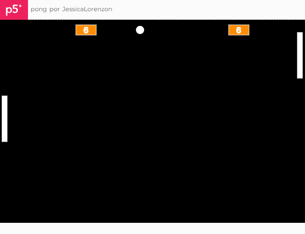

# pong

Projeto criado durante o curso [Jogos clássicos parte 1: iniciando no Javascript com Pong](https://cursos.alura.com.br/course/pong-javascript) da Alura.

Você pode ver o resultado final [aqui](https://editor.p5js.org/JessicaLorenzon/full/b9aBu2iUT).

